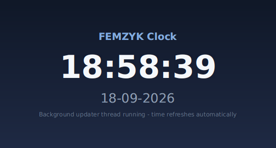

# FEMZYK Clock Application

A **simple clock application** built for *CS 1103-01 – Programming Assignment Unit 3*:
a Java **multithreaded** clock that continuously displays the current time and date —
a styled **JavaFX front end** (bonus) and a **console version** (the assignment
deliverable), both driven by threads with different priorities.

🔗 **Repository:** https://github.com/FEMZYKENTLTD/FEMZYK-ClockApplication



## 🧵 Threaded design (the assignment core)

| Thread | Priority | Role |
|--------|----------|------|
| `ClockDisplay` | `MAX_PRIORITY` (10) — **higher** | Runs the `Clock` method that continuously prints the time in `HH:mm:ss dd-MM-yyyy` every second |
| `TimeUpdater` | `NORM_PRIORITY` (5) — lower | Refreshes the shared time in the background every 100 ms for better timekeeping precision |

- The shared time and the stop flag are **`volatile`**, so both threads always see the
  latest values without conflicts (synchronization by visibility).
- Both loops handle `InterruptedException` correctly, restore the interrupt status, and
  exit cleanly when `Clock.stop()` is called — no orphaned threads, no leaked resources.
- The `Clock` class formats output with `java.time` + `DateTimeFormatter`, with
  error handling around the formatting call.

## 📁 Project layout

```
FEMZYK-ClockApplication/
├── pom.xml                                              Maven build file (JavaFX + plugins)
├── docs/                                                Screenshots used by this README
└── src
    ├── main/java
    │   ├── com/femzyk/clock/Clock.java                  Clock class: shared time, update/print loops, stop flag
    │   ├── com/femzyk/clock/gui
    │   │   ├── Launcher.java                            Entry point of the JavaFX front end
    │   │   └── ClockFxApp.java                          JavaFX clock (reuses the same Clock class)
    │   └── Main.java                                    Console demonstration with thread priorities
    ├── main/resources/com/femzyk/clock/gui
    │   └── styles.css                                   JavaFX stylesheet
    └── test/java/com/femzyk/clock/gui
        └── SnapshotRunner.java                          Dev utility that captures the GUI screenshot
```

## ✅ Requirements

- **JDK 17 or newer** (built and tested on JDK 25 with JavaFX 26)
- **Maven 3.8+**
- VS Code users: the **Extension Pack for Java** extension

## 🚀 Build and run

```bash
# 1. compile and package (clean build: no errors, no warnings)
mvn clean package

# 2. run the console clock (the assignment demonstration)
java -cp target/femzyk-clock-1.0.0.jar Main

# 3. run the JavaFX graphical clock
mvn javafx:run
```

In VS Code: open the project folder, wait for the Java extension to load it, then open
`Main.java` (console) or `Launcher.java` (GUI) and click **Run** above the `main` method
(or press **F5**).

The console version prints its thread priorities, ticks every second for 15 seconds,
and then performs a clean shutdown of both threads:

```
ClockDisplay thread : priority 10 (MAX)  - continuously updates and prints the time
TimeUpdater thread  : priority 5 (NORM) - refreshes the time in the background
----------------------------------------------
  18:58:07 18-09-2026
  18:58:08 18-09-2026
  ...
Clock stopped cleanly after 15 seconds. Both threads exited without conflicts.
```

## 📚 Academic context

Course project for **CS 1103-01 – AY2027-T1, Programming Assignment Unit 3**
(University of the People). Built with Maven and JavaFX; compiled with a clean
`BUILD SUCCESS` (no errors, no warnings).
